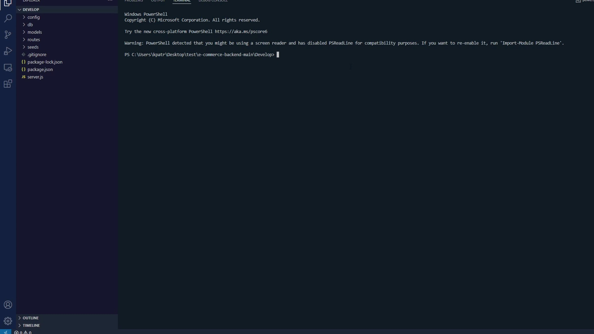

# E-Commerce Back End Project

## Keep track and organize all of your products for your e-commerce website with this e-commerce back end application!

### Developed as a challenge for the Rutgers Coding Bootcamp, this app makes use of the Sequelize ORM   

### How to download and set up the application on your local machine:

1. In the dropdown menu from the green "Code" button, select "Download ZIP"

2. Once the ZIP file has been downloaded, unzip it into a directory of your choice (I chose ~/Desktop/test for this example)

3. Navigate to the "Develop" directory within the application files you downloaded

4. Run "npm i" in your CLI

5. In the Develop folder, create a file called ".env" and enter 3 environment variables:
    - DB_NAME='ecommerce_db'
    - DB_USER='(Your MySQL username)'
    - DB_PW='(Your MySQL password)'
    - Remember to save the file!
  

### For better understanding of setting up the application and testing the api routes, watch this video:   

